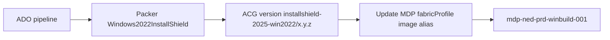

# InstallShield image — NED PRD infrastructure

Targets **existing** resources:

| Resource | Name |
|----------|------|
| Azure Compute Gallery | `acg_ned_prd_mdp_001` |
| Managed DevOps Pool | `mdp-ned-prd-winbuild-001` |

## One-time setup

### 1. Bicep — image definition + gallery Reader role

Fill in `infra/parameters/ned-prd.bicepparam`:

- `galleryResourceGroupName` — RG of `acg_ned_prd_mdp_001`
- `devOpsInfrastructureServicePrincipalObjectId` — from:

```bash
az ad sp list --filter "displayName eq 'DevOpsInfrastructure'" --query "[0].id" -o tsv
```

Deploy (resource group scope — gallery RG `rg-ned-prd-mdp-001`):

```bash
az deployment group create \
  --resource-group rg-ned-prd-mdp-001 \
  --template-file custom/installshield/infra/bicep/main.bicep \
  --parameters custom/installshield/infra/parameters/ned-prd.bicepparam
```

Creates gallery image definition `installshield-2025-win2022` (if missing) and grants **Reader** on the gallery to `DevOpsInfrastructure` ([docs](https://learn.microsoft.com/en-us/azure/devops/managed-devops-pools/configure-images)).

### 2. Bicep — Packer build VM

Windows Server 2022 VM with user-assigned MI `id-aib-win11-installer-gui-001` (Contributor on `rg-ned-prd-mdp-001`).  
Extension instaluje Git, Azure CLI, Packer.

```bash
az deployment group create \
  --resource-group rg-ned-prd-mdp-001 \
  --template-file custom/installshield/infra/bicep/packer-build-vm.bicep \
  --parameters custom/installshield/infra/parameters/packer-build-vm-ned-prd.bicepparam \
  --parameters allowedRdpPrefix='YOUR_IP/32' adminPassword='<SecurePassword1!>'
```

Po deploy (~5 min na extension):

1. RDP na public IP z outputu (`rdpConnection`)
2. Sklonuj repo do `C:\packer-build\runner-images`
3. Uruchom `infra/scripts/Start-InstallShieldImageBuild.ps1` (po uzupełnieniu SAS i git URL)

Lub ręcznie:

```powershell
az login --identity --username f9e04a3f-0472-45cd-8b85-b4e4760f7675
$env:INSTALLSHIELD_INSTALLER_URL = '<SAS>'
cd C:\packer-build\runner-images\custom\installshield\helpers
.\Build-InstallShieldImage-NedPrd.ps1 -ImageVersion '1.0.0' -UseManagedIdentity -RestrictToAgentIpAddress
```

### 3. Azure DevOps variable group `installshield-image-build`

| Variable | Example |
|----------|---------|
| `SUBSCRIPTION_ID` | Azure subscription |
| `GALLERY_NAME` | `acg_ned_prd_mdp_001` |
| `GALLERY_RG_NAME` | RG of the gallery |
| `IMAGE_BUILD_RG_NAME` | RG for Packer temp resources + managed image |
| `AZURE_LOCATION` | `germanywestcentral` |
| `MDP_RG_NAME` | RG of `mdp-ned-prd-winbuild-001` |
| `MDP_POOL_NAME` | `mdp-ned-prd-winbuild-001` |
| `INSTALLSHIELD_ARTIFACTS_STORAGE_ACCOUNT` | Storage with SAB installer blob |
| `INSTALLSHIELD_INSTALLER_SAS_URL` | Secret — SAS to SAB EXE (optional if using blob + MI) |
| `azureServiceConnection` | ARM service connection name (pipeline) |

### 4. Register pipeline

Import `pipelines/build-image-ned-prd.yml` in Azure DevOps.

## Image build flow



1. **BuildImage** — `GenerateResourcesAndImage -ImageType Windows2022InstallShield` with `GALLERY_*` env vars → Packer publishes to `acg_ned_prd_mdp_001`.
2. **RegisterMdp** — `Update-ManagedDevOpsPoolImage.ps1` sets gallery version on pool with alias `installshield-2025`.

## Using the image in application pipelines

```yaml
pool:
  name: mdp-ned-prd-winbuild-001
  demands:
    - ImageOverride -equals installshield-2025

steps:
- task: InstallShieldBuild@1
  inputs:
    ProjectPath: 'src/MyProject.ism'
    ReleaseName: 'SingleExe'
    AgentLocation: 'Private Agent'
    LicType: 'Cloud'
    ISLicenseServerCLSId: '$(ClsId)'
    ISVersion: '2025'
```

See [docs/installshield-win2022-image.md](../../docs/installshield-win2022-image.md) and [Revenera ADO extension](https://community.revenera.com/s/article/installshield-azure-devops-build-extension).
